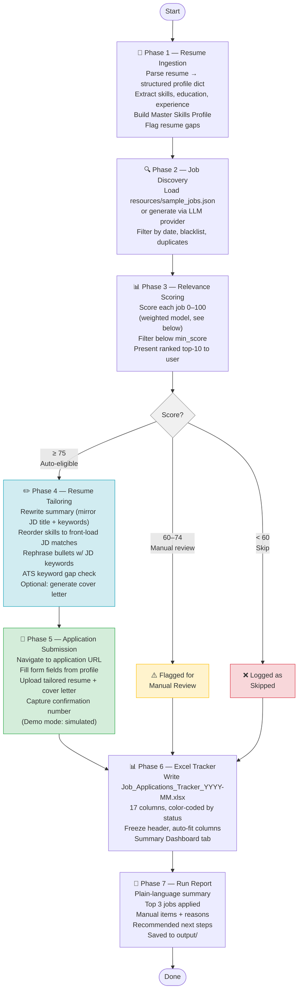

# Job Application Agent

An autonomous, 7-phase Python agent that reads your resume, searches for matching jobs, scores and shortlists them, tailors application materials per posting, (optionally) submits applications, and produces a formatted Excel tracker and run report — all from a single command.

Three backends are supported with no architecture changes: **Anthropic Claude** (highest quality), **local Ollama** (free, private), and **Demo mode** (zero cost, zero setup, works offline).

---

## Table of Contents

- [Project Overview](#project-overview)
- [7-Phase Pipeline](#7-phase-pipeline)
- [Prerequisites](#prerequisites)
- [Setup](#setup)
  - [Mode 1 — Demo (no API key)](#mode-1--demo-no-api-key)
  - [Mode 2 — Ollama (local, free)](#mode-2--ollama-local-free)
  - [Mode 3 — Anthropic Claude (default)](#mode-3--anthropic-claude-default)
- [Personalizing CLAUDE.md](#personalizing-claudemd)
- [Usage Examples](#usage-examples)
- [Output Files](#output-files)
- [Scoring Model](#scoring-model)
- [Known Limitations & Roadmap](#known-limitations--roadmap)

---

## Project Overview

```
agent.py              ← single-file pipeline (all 7 phases + 3 providers)
streamlit_app.py      ← interactive Streamlit web UI (run with: streamlit run streamlit_app.py)
dashboard/
  app.py              ← Flask dashboard for post-scoring review (--dashboard flag)
Workflow/
  job-application-agent.md   ← canonical spec for all phase logic
config/
  skill_keywords.yaml ← configurable skill keyword groups
resources/
  sample_jobs.json    ← cached job postings (auto-generated on first run)
output/               ← all deliverables land here
CLAUDE.md             ← personal context + agent config for Claude Code
requirements.txt
```

The agent is driven by `Workflow/job-application-agent.md`, which is the authoritative specification for scoring weights, tracker schema, and phase behavior. `agent.py` implements that spec. When you modify phase logic, consult the spec first.

---

## 7-Phase Pipeline



---

## Prerequisites

- Python 3.9+
- pip

---

## Setup

### Install dependencies

```bash
pip install -r requirements.txt
```

`requirements.txt` installs the following packages:

| Package | Purpose |
|---|---|
| `anthropic` | Anthropic Claude API (default provider) |
| `openpyxl` | Excel tracker generation (Phase 6) |
| `python-docx` | DOCX resume parsing |
| `rich` | Terminal formatting and progress display |
| `pyyaml` | Skill keywords config (`config/skill_keywords.yaml`) |
| `pdfplumber` | PDF resume parsing |
| `flask` | Dashboard backend (`dashboard/app.py`) |
| `playwright` | Real application submission (`--real-apply`) |
| `streamlit` | Interactive web UI (`streamlit_app.py`) |
| `pandas` | Data manipulation for scoring and tracking |
| `python-jobspy` | Live job board scraping (Phase 2) |
| `openai` | *Optional* — only needed for `--ollama` mode |

**Playwright browser setup** (only needed if using `--real-apply`):
```bash
python -m playwright install
```

---

### Mode 1 — Demo (no API key)

The fastest way to try the agent. Uses pure Python regex/keyword matching and 8 hardcoded EE/semiconductor internship postings (NVIDIA, Apple, Intel, etc.). No network calls, no credentials, fully offline.

```bash
python agent.py --demo
```

**What to expect:** The agent will walk you through the 10-question startup checklist, score all demo jobs against your profile, tailor resume sections using template logic, simulate submissions, write the Excel tracker to `output/`, and print a run report. All outputs are real files.

---

### Mode 2 — Ollama (local, free)

Runs a local LLM on your machine — no API costs, fully private. Requires [Ollama](https://ollama.com) installed and running.

**One-time setup:**
```bash
# 1. Install Ollama from https://ollama.com, then:
ollama pull llama3.2       # ~2 GB download (recommended default)
# or
ollama pull mistral        # alternative
ollama pull gemma3         # lighter option

# 2. Start the Ollama server (if not already running as a background service)
ollama serve
```

**Run:**
```bash
python agent.py --ollama                       # uses llama3.2 by default
python agent.py --ollama --model mistral       # choose a different model
python agent.py --ollama --model gemma3
```

**Note:** Ollama mode uses the OpenAI-compatible `/v1` endpoint at `localhost:11434`. The `openai` package is required (`pip install openai`). JSON output quality varies by model — `llama3.2` and `mistral` are the most reliable choices.

---

### Mode 3 — Anthropic Claude (default)

Uses `claude-opus-4-6` via the Anthropic API. Highest quality output — structured `tool_use` calls enforce JSON schema compliance, and `thinking` mode is enabled for resume parsing and tailoring.

**One-time setup:**

1. Get an API key at [console.anthropic.com](https://console.anthropic.com)
2. Set the environment variable:

```bash
# macOS / Linux
export ANTHROPIC_API_KEY=sk-ant-...

# Windows CMD
set ANTHROPIC_API_KEY=sk-ant-...

# Windows PowerShell
$env:ANTHROPIC_API_KEY="sk-ant-..."

# Permanent (add to your shell profile or System Environment Variables)
```

**Run:**
```bash
python agent.py
```

The agent will error immediately with setup instructions if the key is missing.

---

## Personalizing CLAUDE.md

`CLAUDE.md` serves two purposes: it configures Claude Code's behavior in this repo, and it stores your personal profile so the agent can use your details in cover letters, resume filenames, and fallback demo data.

Open `CLAUDE.md` and fill in every `[placeholder]` in the **Fillable Template** section:

| Field | Used for |
|---|---|
| Full name | Cover letters, resume filenames, `OWNER_NAME` constant |
| LinkedIn URL | Profile extraction, job applications |
| University + major | Demo resume fallback, cover letter body |
| Key skills & tools | Scoring, ATS gap detection, resume tailoring |
| Target companies (whitelist) | Always surfaced in Phase 2 regardless of score |
| Job boards | Phase 2 search scope |
| Preferred resume format | Tailoring output style |

Also update `OWNER_NAME` at the top of `agent.py:29`:

```python
OWNER_NAME = "Your Full Name"   # line 29
```

This string is used in every output filename and cover letter.

---

## Usage Examples

**Quick test run with no setup:**
```bash
python agent.py --demo
# → Accept all defaults at the checklist prompts (just press Enter)
# → Produces output/Job_Applications_Tracker_YYYY-MM.xlsx and a run report
```

**Targeted run with custom job titles and location:**
```bash
python agent.py --demo
# At checklist:
#   Job titles: Photonics Engineering Intern, IC Design Intern
#   Location: San Jose, CA
#   Min score: 80
#   Cover letters: only for >=85
#   Max applications: 5
```

**Use your own resume file:**
```bash
python agent.py --demo
# At prompt 1: Path to resume (PDF/DOCX/TXT): resources/MyResume.docx
```
Supported formats: `.txt`, `.md`, `.docx`, `.pdf` (PDF parsing via `pdfplumber`).

**Full Claude run with custom jobs:**
```bash
# 1. Drop your job postings into resources/sample_jobs.json
#    (follow the schema in Resources/sample_jobs.json)
# 2. Run:
python agent.py
# The agent loads your JSON instead of generating jobs
```

**Exclude companies and set a salary floor:**
```bash
python agent.py --ollama
# At checklist:
#   Companies to exclude: Google, Meta
#   Minimum salary: $40/hr
```

---

## Output Files

All outputs are written to `output/`:

| File | Description |
|---|---|
| `Job_Applications_Tracker_YYYY-MM.xlsx` | 17-column Excel tracker with color-coded status rows and a Summary Dashboard tab |
| `YYYYMMDD_job-application-run-report.md` | Plain-language run summary: stats, top 3 jobs, manual items, next steps |
| `[Name]_Resume_[Company]_[Title].txt` | Tailored resume sections per job (summary, reordered skills, ATS gaps) |
| `[Name]_CoverLetter_[Company].txt` | Cover letter if cover letter mode is enabled |

**Tracker color coding:**

| Color | Status |
|---|---|
| Green | Applied |
| Yellow | Manual Required |
| Red | Skipped (low match) |
| Gray | Error |

---

## Scoring Model

Phase 3 scores each job 0–100 using this weighted model:

| Category | Weight |
|---|---|
| Required skills match | 30% |
| Job title alignment | 25% |
| Years of experience match | 15% |
| Education requirement met | 10% |
| Industry / domain overlap | 10% |
| Location / remote compatibility | 10% |

**Thresholds** (configurable at startup):

| Score | Action |
|---|---|
| ≥ 75 | Auto-eligible — shown to user for approval, then processed |
| 60–74 | Flagged for manual review — logged but not submitted |
| < 60 | Skipped — logged with reason |

---

## Configuration

### Environment Variables

| Variable | Required | Description |
|---|---|---|
| `ANTHROPIC_API_KEY` | For default mode | Anthropic API key (`sk-ant-...`) |
| `SMTP_HOST` | Optional | SMTP server hostname (e.g. `smtp.gmail.com`) |
| `SMTP_PORT` | Optional | SMTP port (e.g. `465` for SSL) |
| `SMTP_USER` | Optional | SMTP login username / sender address |
| `SMTP_PASS` | Optional | SMTP login password or app password |
| `NOTIFY_EMAIL` | Optional | Recipient address for run-completion emails |
| `INDEED_API_KEY` | Optional | Enables live Indeed job fetch in Phase 2 (stub — implementation pending) |

If all five SMTP variables are set, Phase 7 will email the run report to `NOTIFY_EMAIL` with subject `"Job Application Run Complete — YYYY-MM-DD (N applied)"`. If any variable is missing, email is silently skipped and a warning is printed.

**Setting variables (bash / macOS / Linux):**
```bash
export SMTP_HOST=smtp.gmail.com
export SMTP_PORT=465
export SMTP_USER=you@gmail.com
export SMTP_PASS=your-app-password
export NOTIFY_EMAIL=you@gmail.com
```

**Setting variables (Windows CMD):**
```cmd
set SMTP_HOST=smtp.gmail.com
set SMTP_PORT=465
set SMTP_USER=you@gmail.com
set SMTP_PASS=your-app-password
set NOTIFY_EMAIL=you@gmail.com
```

---

### config/skill_keywords.yaml

Controls which skill keywords `DemoProvider` matches against resumes and job requirements. Edit this file to adapt the agent to any field — no Python changes needed.

```yaml
# config/skill_keywords.yaml
hardware:         # IC/FPGA/PCB skills
  - verilog
  - fpga
  - cmos
  - pcb

software:         # Languages and OS tools
  - python
  - matlab
  - c++
  - linux

domain:           # Domain-specific lab / process skills
  - photolithography
  - cleanroom
  - sem
  - thin film
```

All groups are flattened into one list at runtime. Add new groups freely — `DemoProvider` iterates over all top-level keys.

---

### CLI Flags

| Flag | Description |
|---|---|
| `--demo` | Template/regex mode — no API key required |
| `--ollama` | Use local Ollama LLM |
| `--model MODEL` | Ollama model name (default: `llama3.2`) |
| `--section-order SECTIONS` | Comma-separated resume section order, e.g. `Summary,Skills,Experience,Projects,Education` |
| `--real-apply` | Use Playwright for real form submission (Greenhouse boards); falls back to simulation for others |
| `--dashboard` | Launch Flask dashboard at `http://localhost:5000` after Phase 3 scoring for interactive review |

---

## Streamlit Web UI

A full interactive web interface is available via Streamlit. It provides a browser-based way to configure, run, and monitor the agent pipeline.

```bash
streamlit run streamlit_app.py
# Opens at http://localhost:8501
```

The Streamlit UI lets you:
- Configure run settings (mode, model, thresholds) from the sidebar
- Upload your resume directly in the browser
- Monitor pipeline progress through all 7 phases
- Review scored jobs and tailored materials interactively
- Download the Excel tracker and run report

---

## Known Limitations & Roadmap

### Current limitations

- **Live job scraping has limitations.** Phase 2 can scrape job boards via `python-jobspy`, but rate limits and site changes may affect results. For reliability, you can also provide your own `resources/sample_jobs.json`.
- **Real form submission is experimental.** `--real-apply` uses Playwright for Greenhouse-style boards; other ATS platforms fall back to simulation.
- **Demo provider is EE/semiconductor-specific.** The hardcoded `DEMO_JOBS` and `DemoProvider` skill keywords are tuned for electrical engineering internship profiles. Adapting to other fields requires updating `DEMO_JOBS` and `config/skill_keywords.yaml`.
- **Ollama output quality is model-dependent.** Smaller or quantized models may produce malformed JSON; the provider falls back gracefully but scoring and tailoring will be less precise.
- **Single-session memory only.** The agent does not persist a cross-run application history. The Excel tracker is the only deduplication record, and it is not read back on subsequent runs.

### Roadmap

- [x] Live job board scraping (via `python-jobspy` in Phase 2)
- [x] Real application submission via Playwright browser automation (`--real-apply`)
- [x] PDF resume parsing (via `pdfplumber`)
- [x] Web UI / dashboard for reviewing scored jobs before submission (Streamlit UI + Flask dashboard)
- [x] Email notification on run completion (Phase 7, via SMTP env vars)
- [x] Support for custom section ordering (`--section-order` flag)
- [x] Field-agnostic skill keyword config (`config/skill_keywords.yaml`)
- [ ] Cross-run deduplication by loading existing tracker on startup
- [ ] LinkedIn Jobs API / Indeed Publisher API integration (beyond scraping)
